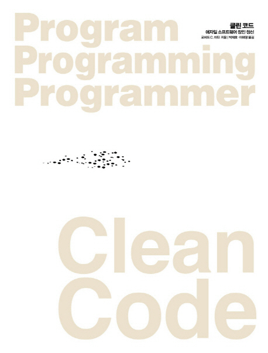

# Code Bibliotheca

책을 읽으며 각자 공부한 내용을 종합해 정리하는 repository입니다.

## 📌 Rules

### Place & Time ☕

- 강남역 스터디 카페

### How to Record ✒️

- 매주 발표 및 공부 내용을 주번이 통합해 정리합니다.
- 스터디를 진행한 책 디렉터리에 주차별 디렉터리를 생성하고, 설명 및 간단한 코드는 해당 디렉터리의 README.md 파일로, 따로 봤으면 하는 코드라면 생성해 추가하시면 됩니다.

## 📖 Book List

|                               [Clean Code](/cleanCode)                                |
| :-----------------------------------------------------------------------------------: |
|  |

## 🐬 Members

<table>
  <tr>
    <td align="center"><a href="https://github.com/YoujungSon">  <b>yyoujg</b></a> 
    </td>
    <td align="center"><a href="https://github.com/jiji-hoon96">  <b>JIHOON LEE</b></a> </td>
    <td align="center"><a href="https://github.com/bubobubobo">  <b>sujong</b></a> </td>
    <td align="center"><a href="https://github.com/hanyiseo2">  <b>Hanyi SEO</b></a> </td>
        <td align="center"><a href="https://github.com/jihyeon-kimy">  <b>jihyeon kim</b></a> </td>

  </tr>
</table>
